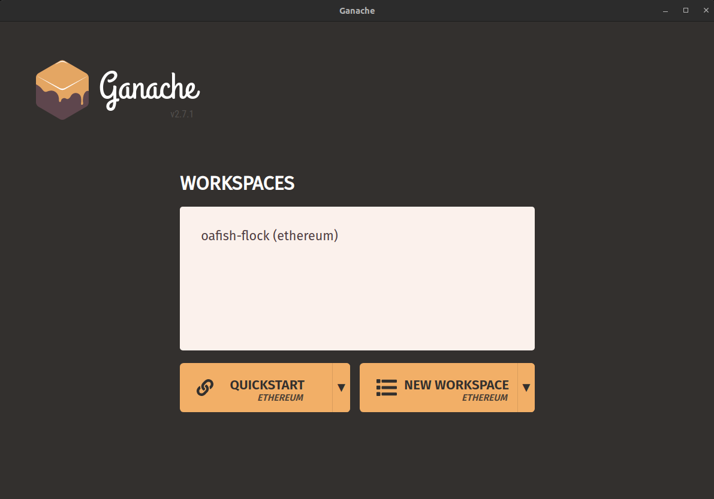
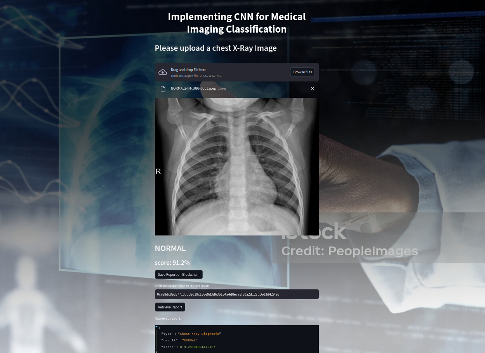
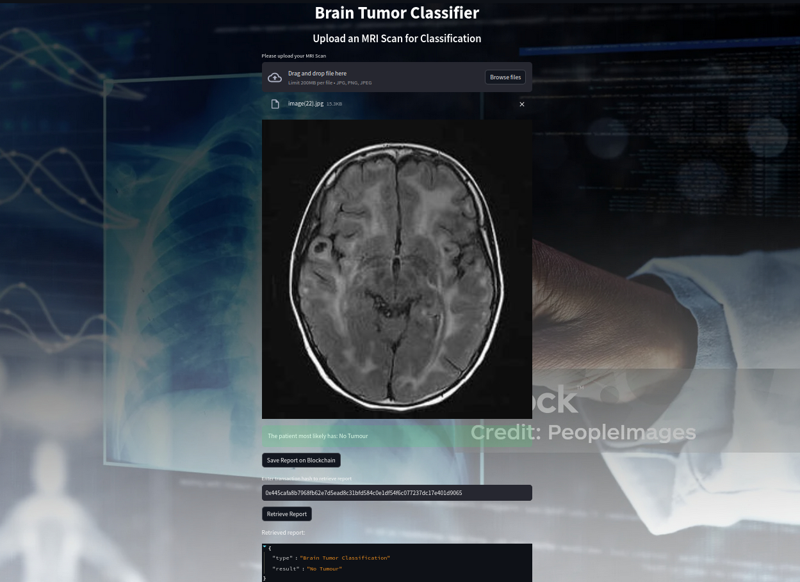

# Blockchain-Integrated Medical Imaging - Secure Diagnostics using Deep Learning

## Overview

This project leverages the power of convolutional neural networks (CNNs) for medical imaging classification, combined with blockchain technology for secure and immutable report storage. The application is designed to classify chest X-ray images and brain MRI scans, providing diagnostic results that are stored on the Ethereum blockchain prototype.


source: https://unsplash.com/photos/purple-and-pink-plasma-ball-OgvqXGL7XO4

## Required Packages

To run this project, you will need to install all the packages listed in 

`requirements.txt`

## Running The project

To run the project, first download `ganache` to simulate our blockchain for free from the official website and create a workspace, then as shown below select an option from Quickstart or New Workspace



After the setup you can run the project using the command
```bash
  streamlit run bc_integration.py
```
## Sample Output for Chest Classification



## Sample Output for Brain Classification



If you have any issues or doubts regarding the project please feel free to contact me on my email `vibhavvedpathak2001@gmail.com`


